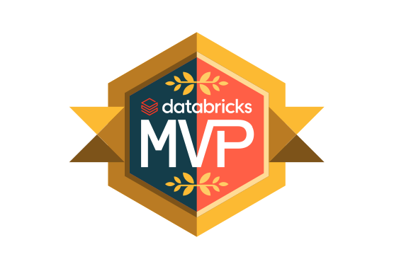

# Production-Ready Declarative Automation Bundles (DABs)

A collection of real-world, scenario-based Declarative Automation Bundle templates designed to accelerate deployment, automate workflows, and optimise compute costs.

---

## What's Inside

- **Visual Architectures:** Diagram-first approach for every scenario.
- **Production Code:** Copy-paste-ready `databricks.yml` and project files.
- **Cost Optimisation:** Built-in best practices for compute configurations.

---

## Learning Index

| Module | Description | Tech Stack |
| :--- | :--- | :--- |
| [01. Introduction to DABs](./learning/01-introduction-to-dab) | Set up your local environment and deploy your first Hello World Databricks Asset Bundle | DABs, YAML, Python |
| [02. Job with Parameters](./learning/02-job-parameters) | Define job parameters and pass dynamic values into a PySpark script at runtime | DABs, YAML, PySpark |
| [03. Schedule a Job](./learning/03-schedule-a-job) | Automate job execution with Quartz cron expressions and deploy notebooks as Python files | DABs, YAML, Python |
| [04. File Trigger](./learning/04-file-trigger) | Trigger a job automatically when a new file lands in a Unity Catalog Volume | DABs, YAML, Unity Catalog |
| [05. Table Update Trigger](./learning/05-table-update-trigger) | Trigger a job automatically when a Delta Table is updated | DABs, YAML, Delta Lake |
| [06. Run Multiple Tasks](./learning/06-run-multiple-tasks) | Build a Directed Acyclic Graph (DAG) with parallel tasks and sequential dependencies | DABs, YAML, Python |
| [07. Task Parameters](./learning/07-task-parameters) | Pass dynamic values from an upstream task to multiple downstream tasks using `taskValues` | DABs, YAML, Python |
| [08. Conditional Execution](./learning/08-use-if-else-task) | Implement success and failure routing using the `run_if` parameter | DABs, YAML, Python |
| [09. SQL Tasks with Variable Lookup](./learning/09-sql-tasks-with-variable-lookup) | Execute raw SQL files on a SQL Warehouse and resolve infrastructure IDs dynamically using `lookup` | DABs, YAML, SQL |
| [10. SQL Alerts](./learning/10-run-sql-alerts) | Provision SQL Alerts and trigger them from a Workflow using `alert_task` | DABs, YAML, SQL |
| [11. Run dbt on Databricks](./learning/11-run-dbt-on-databricks) | Orchestrate a dbt Core project natively in Databricks Workflows using the `dbt_task` type | DABs, YAML, dbt, SQL |
| [12. Create a Pipeline](./learning/12-create-pipeline) | Provision a Serverless Delta Live Tables pipeline with Bronze and Silver layers | DABs, YAML, DLT, Python |
| [13. Advanced Orchestration](./learning/13-advanced-job-pipeline) | Build a master orchestrator that triggers a notebook, a DLT pipeline, and a child job in a single workflow | DABs, YAML, DLT, Python |

---

## Scenario Index

| Scenario | Description | Tech Stack |
| :--- | :--- | :--- |
| [01. Automate Databricks Resource Creation](./scenarios/01-automate-databricks-resources-creation) | Template-driven automation for deploying Databricks resources (Jobs, Pipelines, Monitors, Dashboards) | DABs, YAML, Jinja2, Python |
| [02. Enterprise Databricks Orchestration](./scenarios/02-enterprise-databricks-orchestration) | Modular enterprise repository structure with domain-driven workflows, dynamic glob loading, and cross-job/pipeline orchestrations | DABs, YAML, DLT, Python |

---

## Created by Shamen Paris

  
  

    <strong>Databricks MVP | Data & AI Consultant</strong>
      
    • <a href="https://medium.com/@shamen1209">Medium Articles</a> 
    • <a href="https://www.youtube.com/@shamnix_data_and_ai">YouTube Channel</a>
  

