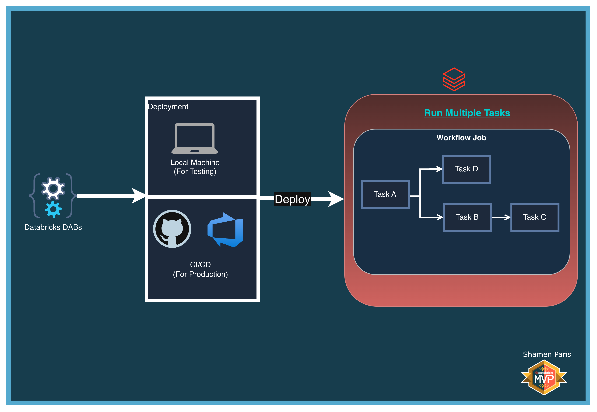
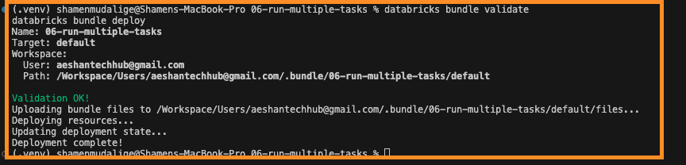
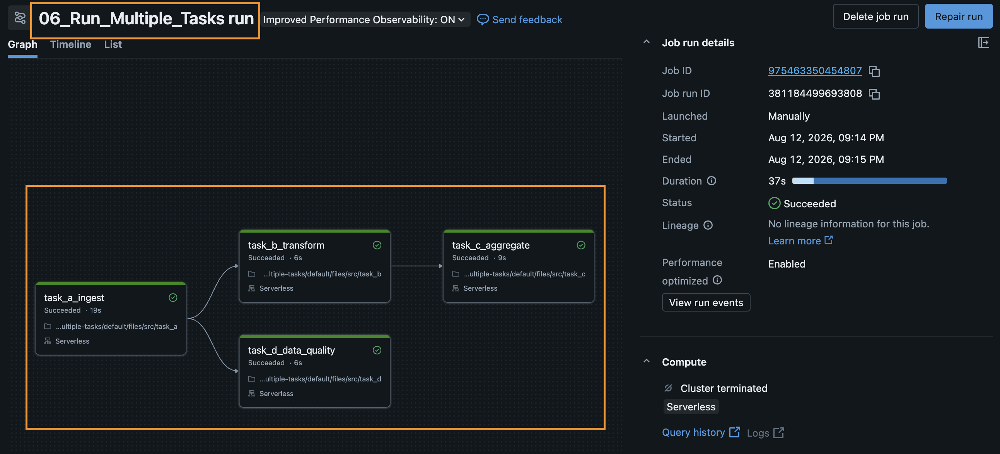

# 06: Run Multiple Tasks

In this module, you will learn how to build a Directed Acyclic Graph (DAG) in Databricks Workflows by orchestrating multiple tasks with dependencies.

The workflow in this module follows this structure:

- **Task A** runs first.
- **Task B** and **Task D** run in parallel after Task A succeeds.
- **Task C** runs only after Task B succeeds.

All tasks reference the standard Unity Catalog environment: `main.demo`.

## What Are We Building?



## Prerequisites and Local Setup

[Prerequisites and Local Setup](../../docs/learning/00-initial-setup/README.md)

## Bundle Structure

1. `databricks.yml` — The master control file.
2. `resources/jobs/multi_task_job.yml` — Defines all tasks and their `depends_on` relationships.
3. `src/task_a.py` through `src/task_d.py` — Individual Python notebooks that execute in order.

## How to Deploy and Run

Once authenticated, navigate to this folder (`06-run-multiple-tasks`) in your terminal.

**Step 1: Validate and deploy**

```bash
databricks bundle validate
databricks bundle deploy
```



**Step 2: Run the job**

```bash
databricks bundle run multi_task_job
```

