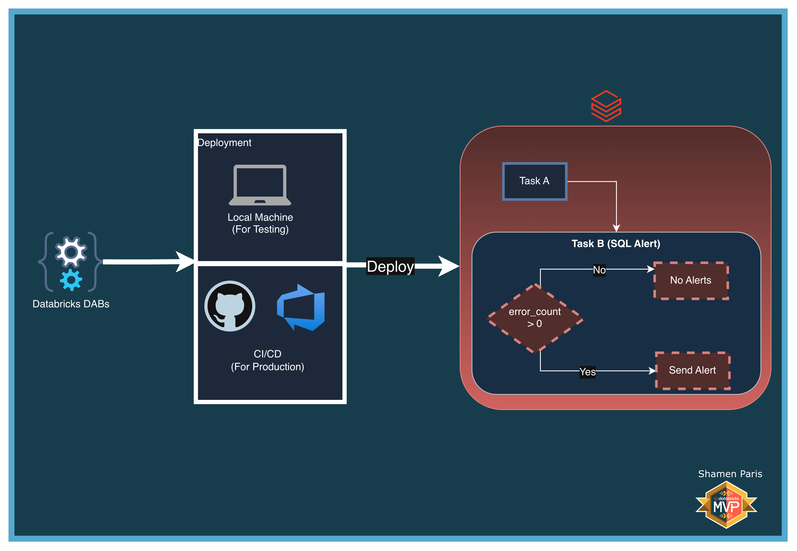
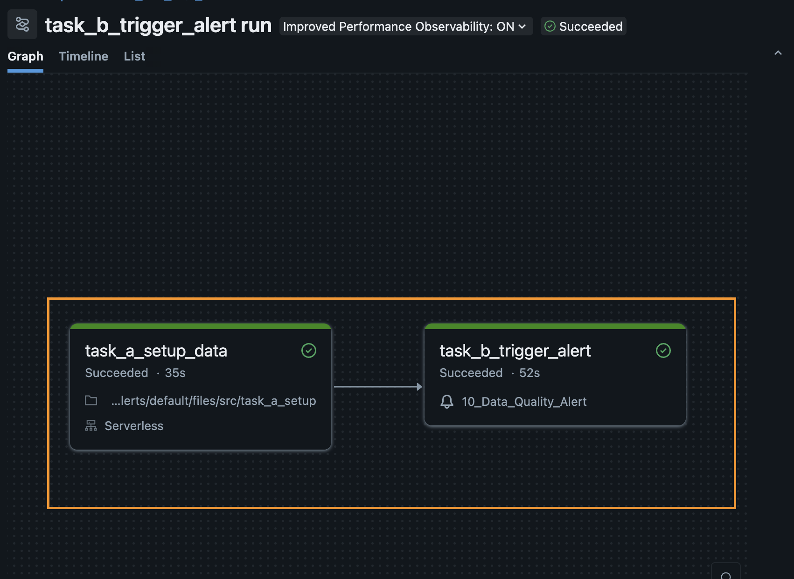
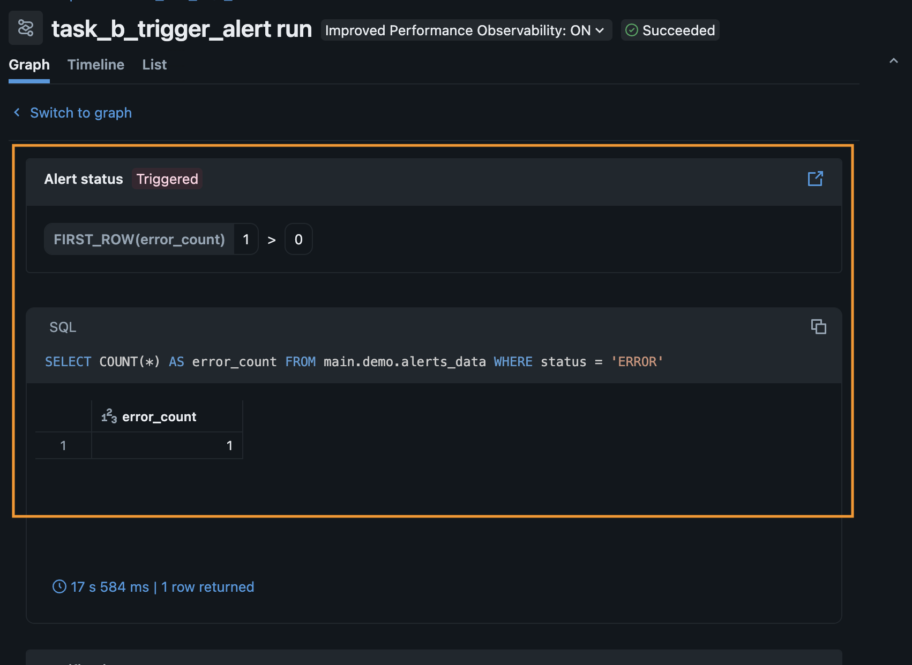

# 10: SQL Alerts

In this module, you will learn how to use Databricks Asset Bundles to provision multiple resource types in a single deployment. You will define a SQL Alert and a Databricks Workflow together, allowing the workflow to evaluate the alert immediately after data ingestion completes.

The two resources provisioned in this bundle are:

1. A **SQL Alert** — Embeds a data quality query and evaluates it against a threshold.
2. A **Databricks Workflow** — Orchestrates the pipeline and triggers the alert evaluation using the `alert_task` type.

## What Are We Building?



## Prerequisites and Local Setup

[Prerequisites and Local Setup](../../docs/learning/00-initial-setup/README.md)

**Additional requirement:** A SQL Warehouse named exactly `Serverless Starter Warehouse` must exist in your Databricks Workspace.

## Bundle Structure

1. `databricks.yml` — Master control file using `**/*.yml` to load all resource types, with dynamic `lookup` variable resolution.
2. `resources/alerts/data_quality_alert.yml` — Provisions the alert, embedding the `query_text` and evaluation condition.
3. `resources/jobs/alert_job.yml` — Orchestrates the setup notebook and uses `alert_task` to trigger the alert evaluation.
4. `src/task_a_setup.py` — Creates the target table and intentionally inserts an error record so the alert condition is met.

## How to Deploy and Run

Once authenticated, navigate to this folder (`10-run-sql-alerts`) in your terminal.

**Step 1: Validate and deploy**

```bash
databricks bundle validate
databricks bundle deploy
```

**Step 2: Run the job**

```bash
databricks bundle run sql_alert_job
```



**Step 3: Verify the output**

`task_a_setup_data` executes via the Python engine to generate the mock data. `task_b_trigger_alert` forces the SQL Alert to evaluate on the SQL Warehouse. Navigate to the **Alerts** tab in your workspace UI to confirm the alert has transitioned to a `TRIGGERED` state.

