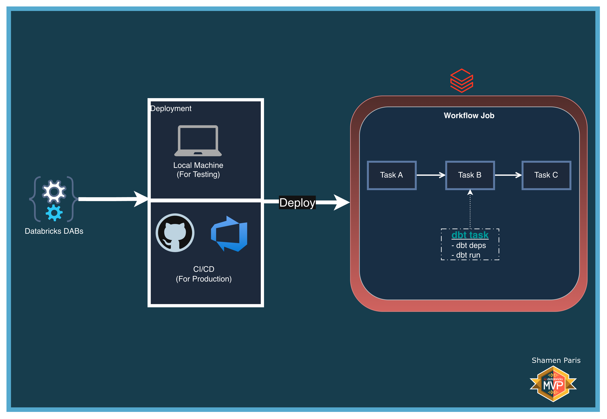

# 11: Run dbt on Databricks

In this module, you will learn how to orchestrate a dbt Core project natively inside a Databricks Workflow using the `dbt_task` type. This removes the need for external orchestration tools and complex authentication setups — Databricks handles compute provisioning, profile injection, and log streaming automatically.

The workflow follows a three-step DAG: setup raw data (Python) → run dbt models (SQL Warehouse) → validate the output (Python).

## What Are We Building?



## Prerequisites and Local Setup

[Prerequisites and Local Setup](../../docs/learning/00-initial-setup/README.md)

**Additional requirement:** A SQL Warehouse named exactly `Serverless Starter Warehouse` must exist in your Databricks Workspace.

## Bundle Structure

1. `databricks.yml` — Master control file with dynamic `lookup` variable resolution.
2. `resources/jobs/dbt_job.yml` — Defines a three-task DAG using `notebook_task`, `dbt_task`, and `notebook_task`.
3. `src/dbt_project/` — A self-contained dbt Core project with its own models and `dbt_project.yml`.
4. `src/task_a_setup.py` — Prepares the raw source table in `main.demo`.
5. `src/task_c_validate.py` — Reads and displays the dbt-transformed output table.

## How to Deploy and Run

Once authenticated, navigate to this folder (`11-run-dbt-on-databricks`) in your terminal.

**Step 1: Validate and deploy**

```bash
databricks bundle validate
databricks bundle deploy
```

**Step 2: Run the job**

```bash
databricks bundle run dbt_orchestration_job
```

**Step 3: Verify the output**

`task_a_setup_data` creates the raw source table, `task_b_dbt_run` compiles and runs the dbt model (`stg_users.sql`) on the SQL Warehouse, materialising it as a Delta table in `main.demo`. `task_c_validate_output` then reads and displays the filtered result.

<video src="../../docs/learning/11-run-dbt-on-databricks/02-dbt-run.mp4" width="100%" controls></video>