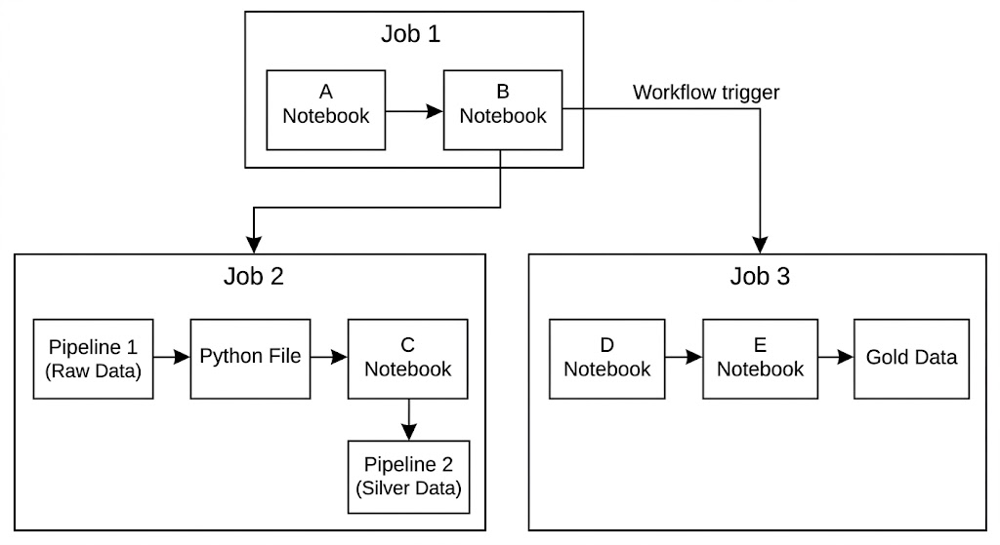

# Enterprise Databricks Orchestration

A demonstration of advanced enterprise orchestration on Databricks using Databricks Asset Bundles (DAB). This scenario illustrates how to structure a modular Databricks repository containing multiple pipelines and jobs organised by business domain (e.g., Product and Retail).

By breaking down large monolithic Databricks workflows into smaller, interconnected jobs and pipelines, teams can achieve better maintainability, clearer dependency management, and easier debugging.

---

## Architecture Overview

This module provisions an interconnected set of resources:



## Scenario Highlights

- **Modular Resources:** Resources are organised logically into domain folders (`product` and `retail`) rather than lumped into a single file.
- **Dynamic Glob Inclusion:** The `databricks.yml` dynamically loads all YAML configurations from deeply nested directories using the `**/*.yml` pattern.
- **Variable Injection:** Uses `variables` to inject standard target schemas and catalogs (e.g., `main.demo`) into resources dynamically.
- **Production-Grade Orchestration:** Demonstrates how Databricks Workflows can act as a fully-fledged enterprise orchestrator (similar to Airflow). It dynamically resolves dependencies between disparate assets using their logical bundle IDs (e.g., `${resources.jobs.job3.id}` or `${resources.pipelines.dlt_pipeline_bronze.id}`) rather than hardcoding environment-specific IDs.
- **Job-to-Job Dependencies:** Shows how a master orchestrator job (`job1`) can trigger other standalone downstream jobs (`job2` and `job3`) using the `run_job_task` capability.
- **Pipeline Orchestration:** Shows how to trigger Delta Live Tables pipelines (`dlt_pipeline_bronze` and `dlt_pipeline_silver`) seamlessly from within standard Databricks Jobs.
---

## Repository Structure

```
scenarios/02-enterprise-databricks-orchestration/
    databricks.yml                      Main bundle configuration
    variables/
        var_defs.yml                    Global variable definitions (e.g., catalog, schema)
    resources/
        jobs/
            product/
                job1.yml                Master orchestrator job
                job3.yml                Downstream product job
            retail/
                job2.yml                Downstream retail job
        pipelines/
            product/
                dlt_pipeline_bronze.yml Bronze ingestion pipeline
            retail/
                dlt_pipeline_silver.yml Silver transformation pipeline
    src/
        files/                          Standard Python scripts
            initial_run.py
            dlt_pipeline_bronze.py
            dlt_pipeline_silver.py
        notebooks/                      Databricks Notebooks
            notebook_A.py
            notebook_B.py
            notebook_C.py
            notebook_D.py
            notebook_E.py
    docs/                               Documentation and architecture diagrams
```

---

## Quick Start

### 1. Validate Configurations

```bash
cd scenarios/02-enterprise-databricks-orchestration
databricks bundle validate -t dev
```

### 2. Deploy to Databricks

```bash
databricks bundle deploy -t dev
```

### 3. Run the Orchestration

Trigger the master orchestrator (`job1`). This will recursively trigger the pipelines and downstream jobs as defined in the dependencies.

```bash
databricks bundle run job1 -t dev
```
